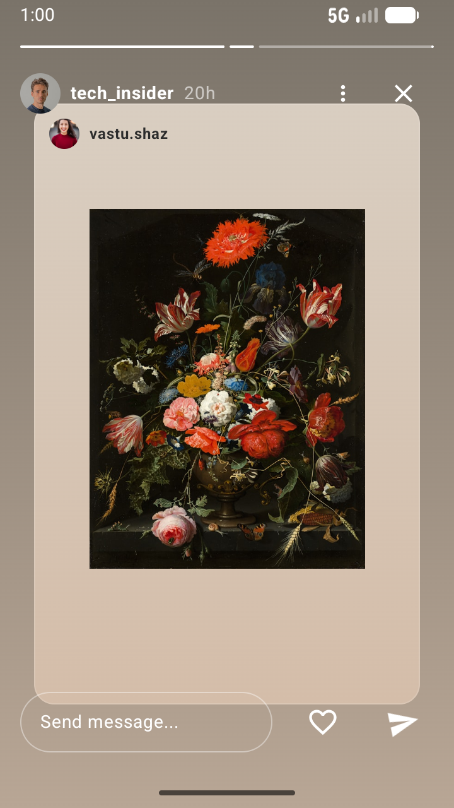
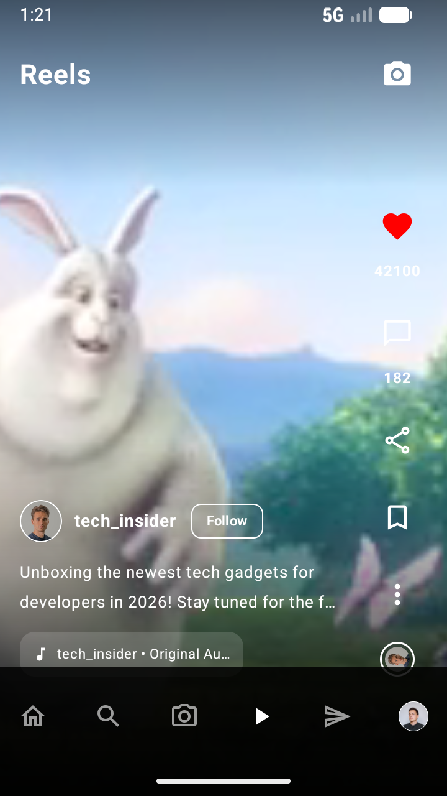
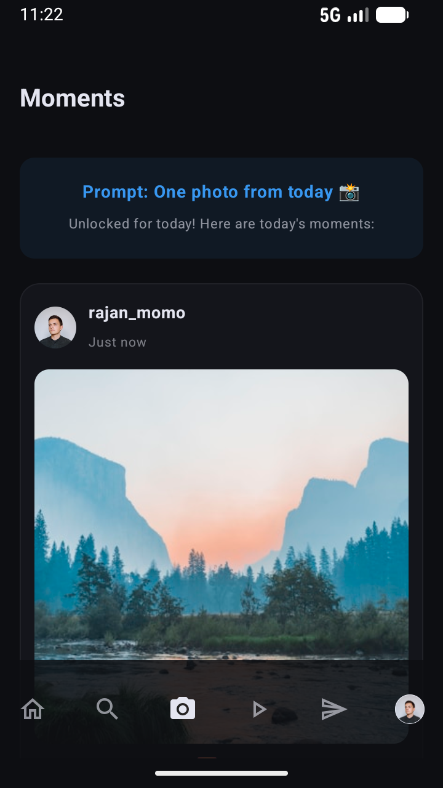
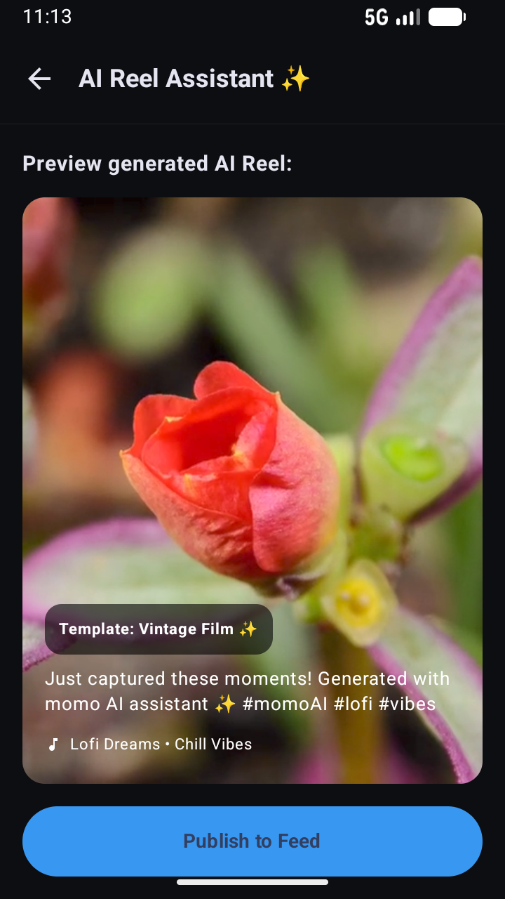
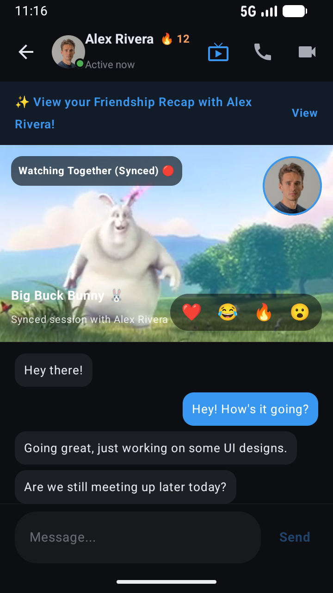
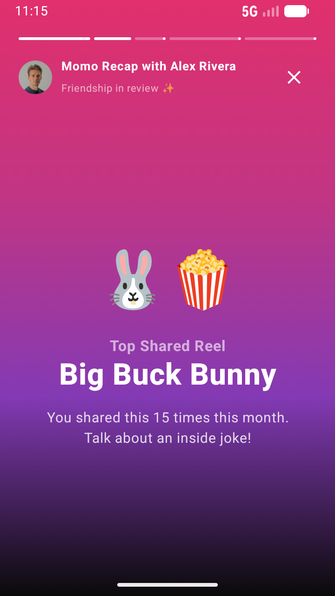

# 🍑 Momo

Momo is a next-generation AI-powered, engagement-driven social media application built natively with Jetpack Compose. Momo transforms passive content consumption into active social interactions with immersive, real-time shared spaces and intelligent content creation pipelines.

<p align="center">
  
</p>

---

## 🌟 Key Features

### 1. Reimplemented Story View
An immersive, custom full-screen story viewer aligned with modern premium aesthetics:
- **Shared Post Card**: Custom warm gradients mimicking real-world paper structures (`linear-gradient(to bottom, #d9cec1, #d4bda9)`).
- **Auto-Advance**: Smoothed `LinearProgressIndicator` timers (5-second segments).
- **Tapping Navigation**: High-speed touch boundaries (left 40% to go back, right 60% to skip).
- **In-Story Interaction**: Real-time message replies, toggleable heart reactions, and direct message forwarding.

<p align="center">
  
</p>

### 2. Premium Reels View
An elegant full-screen video player with integrated overlay controls:
- **Spark Supperclub Gradients**: Replaces standard flat overlays with top and bottom vertical gradients to guarantee maximum text readability.
- **Translucent Bottom Nav Offset**: All captions, user avatars, and action sidebars are offset by `96.dp` to clear bottom navigation tabs.

<p align="center">
  
</p>

### 3. Dedicated Daily Moments
A BeReal-style engagement loop that triggers daily creators:
- **Personalized Prompts**: Encourages lurkers to create low-stakes content.
- **Double Camera Capture**: Seamless front-and-back face-detection captures.
- **Blurred Feed Lock**: Keeps the community active—users must post their Daily Moment to unlock and view friends' submissions.

<p align="center">
  
</p>

### 4. AI Reels Assistant
Automated creator pipeline helping users compose high-fidelity Reels:
- **Image Selection & Sorting**: Interactive multi-select grid.
- **Template & Music Matching**: Connects visual styles with optimal audio files.
- **Real-Time Preview**: Renders a live preview prior to final deployment.

<p align="center">
  
</p>

### 5. Watch Together (In-DM Co-Viewing)
Synced social viewing inside chat rooms:
- **Side-by-Side Synced Scrolling**: Lets multiple friends scroll Reels simultaneously in DMs.
- **Live Reaction Overlay**: Highlights friend reactions during co-viewing.

<p align="center">
  
</p>

### 6. Streaks & Friendship Recaps
- **Streaks**: Gamified daily contact flame indicators inside the messages list.
- **Friendship Recaps**: Beautiful yearly recaps summarizing shared content, inside jokes, and reaction statistics in a Spotify-Wrapped style presentation.

<p align="center">
  
</p>

---

## 🛠️ Technology Stack
- **UI Framework**: Jetpack Compose (100% Kotlin)
- **Design System**: Material Design 3 (curated custom palettes)
- **Navigation**: Android Navigation3
- **Media Playback**: Media3 ExoPlayer (background looping & pre-caching)
- **Image Loading**: Coil (Async Image loading & caching)
- **Serialization**: Kotlinx Serialization
- **Build System**: Gradle Kotlin DSL

---

## 🚀 Getting Started

### Prerequisites
- Android Studio Ladybug or newer
- JDK 17+ (or Android Studio Gradle JDK)

### Compilation
Prepend the Gradle Java Home path before executing commands:
```bash
export JAVA_HOME="/Applications/Android Studio.app/Contents/jbr/Contents/Home"
./gradlew assembleDebug
```

The compiled APK will be output to:
`app/build/outputs/apk/debug/app-debug.apk`
