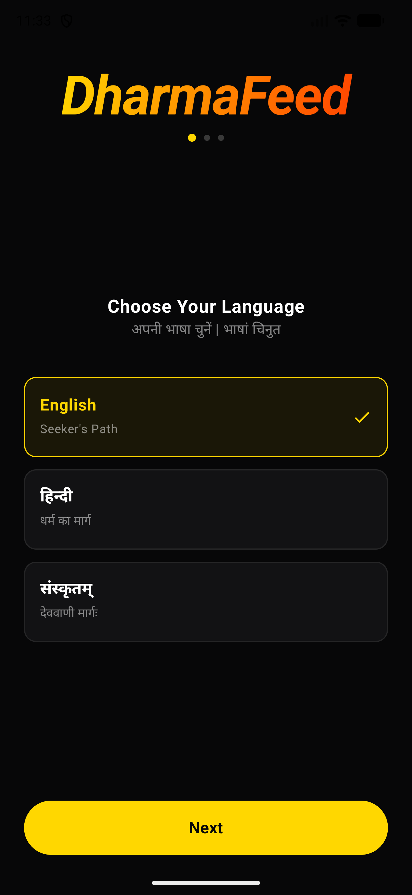
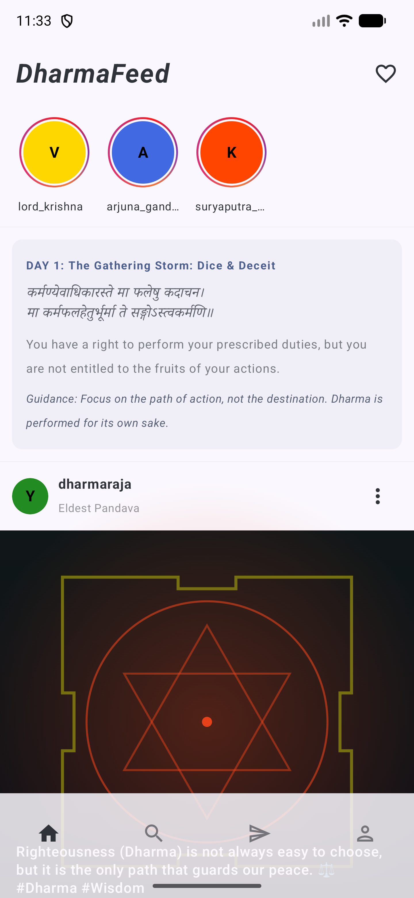
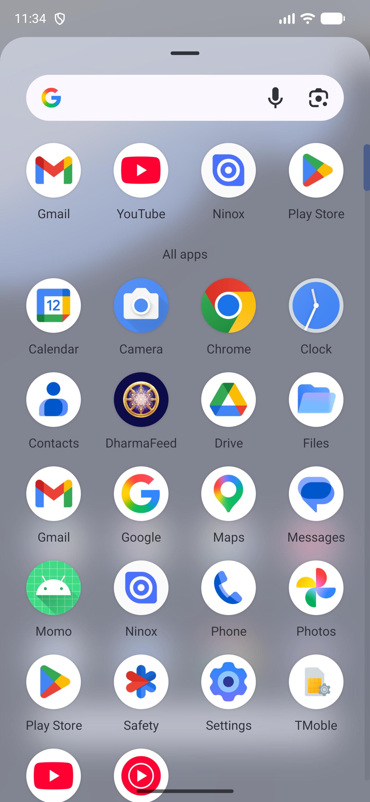

# ☸️ DharmaFeed

DharmaFeed is a premium spiritual application built natively with Jetpack Compose. It invites seekers to embark on a daily interactive journey through the timeless wisdom of the Mahabharata epic and the Bhagavad Gita.

<p align="center">
  
</p>

<p align="center">
  
  
  
</p>

---

## 🌟 Key Features

### 1. ⚔️ The Kurukshetra war Feed
Experience a dynamic 18-day chronicle of the Kurukshetra war:
- **Chronological Progression**: Posts, events, and narratives unfold day-by-day.
- **Battlefield Insights**: Feeds change dynamically based on the active day of the war.
- **Gita Verse Cards**: Reflect on daily Sanskrit verses, translation details, and scriptural relevance.

### 2. 💬 Interactive Dialogue Archive
Receive guidance and direct messages from epic characters:
- **Daily Context Dialogue**: Message history with Krishna, Arjuna, Yudhisthira, and others evolves with the chronicle of the war.
- **Read-Only Battlefield Mode**: Dialogues automatically adjust to read-only mode during war phases to mimic historical constraints.

### 3. 🌐 Complete Multi-Language Locales
A fully localized, translation-safe experience:
- **Supported Languages**: English, Hindi (हिन्दी), and Sanskrit (संस्कृतम्).
- **Locale-Specific Onboarding**: Complete language setup during initial launch that configures all menus, settings, and buttons with no cross-language mixing.

### 4. 🧘‍♂️ Seeker Journey Profile
Track your spiritual path:
- **Interactive Progress**: Track your journey status and active war day index.
- **Bookmarked Wisdom**: Save daily verses and teachings to build your own personal scripture archive.
- **Profile Customization**: In-line editing of display name, seeker username, and spiritual bio.

---

## 🛠️ Technology Stack
- **UI Framework**: Jetpack Compose (100% Kotlin)
- **Design System**: Material Design 3 (curated custom palettes)
- **Navigation**: Android Navigation3
- **Media Playback**: Media3 ExoPlayer (background looping & pre-caching)
- **Image Loading**: Coil (Async Image loading & caching)
- **Serialization**: Kotlinx Serialization
- **Build System**: Gradle Kotlin DSL

---

## 🚀 Getting Started

### Prerequisites
- Android Studio Ladybug or newer
- JDK 17+ (or Android Studio Gradle JBR)

### Compilation

Set the Android Studio JDK path and run the Gradle tasks:
```bash
export JAVA_HOME="/Applications/Android Studio.app/Contents/jbr/Contents/Home"

# Build Debug APK
./gradlew assembleDebug

# Build Signed Release App Bundle (AAB)
./gradlew bundleRelease
```

### Outputs
- **Debug APK**: `app/build/outputs/apk/debug/app-debug.apk`
- **Release App Bundle (AAB)**: `app/build/outputs/bundle/release/app-release.aab`
